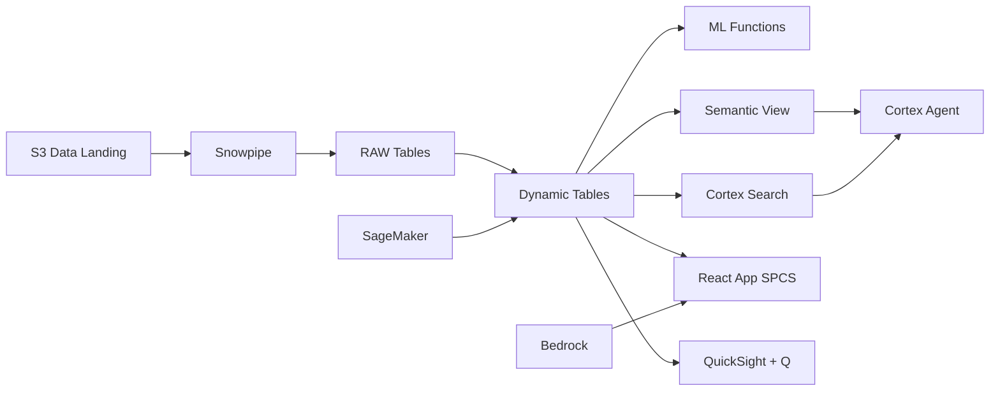

# Takaful Claims Intelligence

AI-powered claims processing for Malaysia's Takaful operators — AI_PARSE_DOCUMENT digitizes claim forms, ML.CLASSIFICATION scores fraud risk, and Cortex Complete generates investigation summaries.

## Architecture

Malaysia's Takaful industry manages RM 35 billion in contributions across 15 licensed operators. A leading family Takaful operator processes 15,000 claims per quarter, but manual review catches only 0.8% of fraudulent claims. When AI_PARSE_DOCUMENT digitizes every claim form and ML.CLASSIFICATION scores fraud risk, the detection rate jumps to 1.9% — catching an additional RM 12.4M in suspicious claims that would have been paid without investigation.



## Snowflake Capabilities

| Capability | Implementation |
|-----------|---------------|
| Dynamic Tables | CLAIMS_DASHBOARD / FRAUD_SCORING / PROVIDER_ANALYTICS / INVESTIGATION_QUEUE |
| ML Functions | ML.CLASSIFICATION + ML.ANOMALY_DETECTION |
| Cortex AI | AI_PARSE_DOCUMENT, AI_EXTRACT, AI_CLASSIFY |
| Cortex Search | 3000 documents indexed |
| Cortex Agent | TAKAFUL_CLAIMS_AGENT |
| Semantic View | TAKAFUL_CLAIMS_ANALYTICS |
| React App (SPCS) | 5 tabs + DemoGuide |


## AWS Services

| Service | Role in Demo |
|---------|-------------|
| Amazon S3 | Store scanned claim documents, medical reports, and receipts |
| Amazon Textract | OCR and extract structured data from claim forms |
| Amazon SageMaker | Train and deploy fraud scoring models |
| Amazon Bedrock (Claude) | Generate investigation summaries and risk narratives |
| Amazon QuickSight + Q | Claims dashboard with natural language exploration |


## Personas

| Persona | Role | Key Questions |
|---------|------|---------------|
| **Dato' Hj. Ibrahim** | CEO Takaful Division | "What is our total claims under investigation?" "How many fraudulent claims were caught this quarter?" |
| **Zainab binti Yusof** | Claims Manager | "Which claims have the highest fraud probability?" "Show me claims patterns by provider and region." |


## Data

| Table | Rows | Description |
|-------|------|-------------|
| CLAIMS | 15,000 | Takaful claims across family and general segments |
| POLICYHOLDERS | 50,000 | Takaful participants (policyholders) profiles |
| INVESTIGATION_NOTES | 3,000 | Claims investigation notes and adjuster reports |
| CLAIM_DOCUMENTS | 8,000 | Scanned claim forms, medical reports, and receipts |
| PROVIDER_NETWORK | 500 | Panel hospitals, clinics, and workshops in network |


## Build Instructions

### Prerequisites
- Snowflake account with ACCOUNTADMIN access
- Cortex AI enabled (ML Functions, Search, Agent)
- Warehouse: TAKAFUL_WH (Medium)
- AWS CLI with access (us-west-2)

### Deployment

```bash
snowsql -f snowflake/00_setup.sql
snowsql -f snowflake/01_marketplace_install.sql
snowsql -f snowflake/02_raw_tables.sql
snowsql -f snowflake/03_staging.sql
snowsql -f snowflake/04_dynamic_tables.sql
snowsql -f snowflake/05_search.sql
snowsql -f snowflake/06_ml_models.sql
snowsql -f snowflake/07_semantic_view.sql
snowsql -f snowflake/08_agent.sql
```

### React App (SPCS)
```bash
cd app && npm ci && npm run build
docker build -t aws-malaysia-islamic-finance-takaful-app .
docker push bdiqc8sm-default.registry.snowflakecomputing.com/islamic_takaful_claims/app/aws_malaysia_islamic_finance_takaful/app:latest
```

### Demo Mode
Open the app URL with `?demo=true` for presenter view.

## Build Modes

### Snowflake Only
Run scripts 00-08 (skip AWS-specific integration). Uses:
- **Snowflake Internal Stage + Directory Tables** instead of Amazon S3
- **AI_PARSE_DOCUMENT** instead of Amazon Textract
- **ML.CLASSIFICATION + ML.ANOMALY_DETECTION** instead of Amazon SageMaker
- **Cortex Complete** instead of Amazon Bedrock (Claude)
- **Snowflake Intelligence (Cortex Analyst)** instead of Amazon QuickSight + Q

### Full AWS + Snowflake
Run all scripts including AWS integration. Deploy QuickSight dashboard from `quicksight/`.

## Business Impact

Industry research and Snowflake customer outcomes:
- **Malaysia's Takaful industry collected RM 35.2B in contributions in 2023, growing 8.4% YoY** — [Bank Negara Malaysia](https://www.bnm.gov.my/insurance-and-takaful)
- **Insurance fraud costs the industry 5-10% of total claims — AI detection reduces losses by 40-60%** — [Coalition Against Insurance Fraud](https://insurancefraud.org/)
- **AI-powered claims processing reduces average handling time by 50-70%** — [McKinsey Insurance](https://www.mckinsey.com/industries/financial-services/our-insights/insurance)
- **Malaysia targets 75% Takaful penetration rate under IFSA 2013 — efficient processing is critical** — [MIFC](https://www.mifc.com/)


## Key Demo Numbers

- **15,000 claims** processed this quarter across family and general Takaful
- **284 fraudulent (1.9%)** claims flagged by ML.CLASSIFICATION
- **RM 47M** total claims value under investigation
- **72 hours** average claim processing time (down from 14 days)
- **4 providers** flagged anomalous by ML.ANOMALY_DETECTION


## License

Apache 2.0 — See [LICENSE](LICENSE) for details.

This is a personal demo project and is not an official Snowflake offering. It comes with no support or warranty.